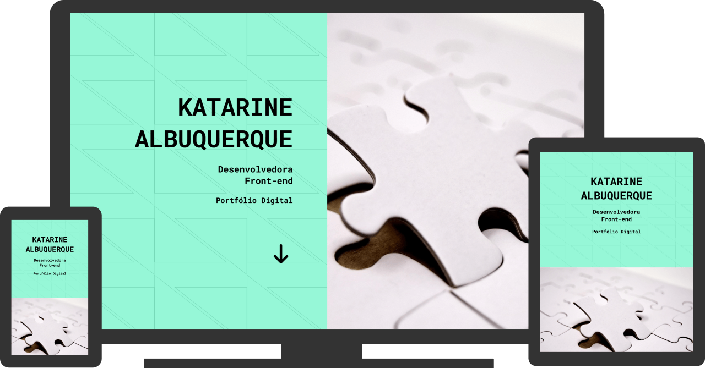

# Portfólio

### Feito com HTML5 e CSS3

Acesse o projeto: [Portfólio](https://albuquerque-katarine.github.io/portfolio)

### Sobre o projeto

Este site foi desenvolvido com foco em design responsivo, utilizando Flexbox para organizar os elementos HTML de forma inteligente e adaptável a diferentes tamanhos de tela. A estrutura flexível garante uma navegação fluida, proporcionando uma experiência consistente tanto em dispositivos móveis quanto em desktops.

### Finalidade do projeto

Oferecer uma experiência de navegação responsiva, adaptável e eficiente, garantindo que o conteúdo seja exibido de forma organizada e agradável em diferentes dispositivos e tamanhos de tela.

### Contato
#### Fale comigo através dos contatos abaixo:

Linkedin: [/katarine-albuquerque](https://www.linkedin.com/in/katarine-albuquerque/) 
E-mail: [kba.2879@gmail.com](mailto:kba.2879@gmail.com)