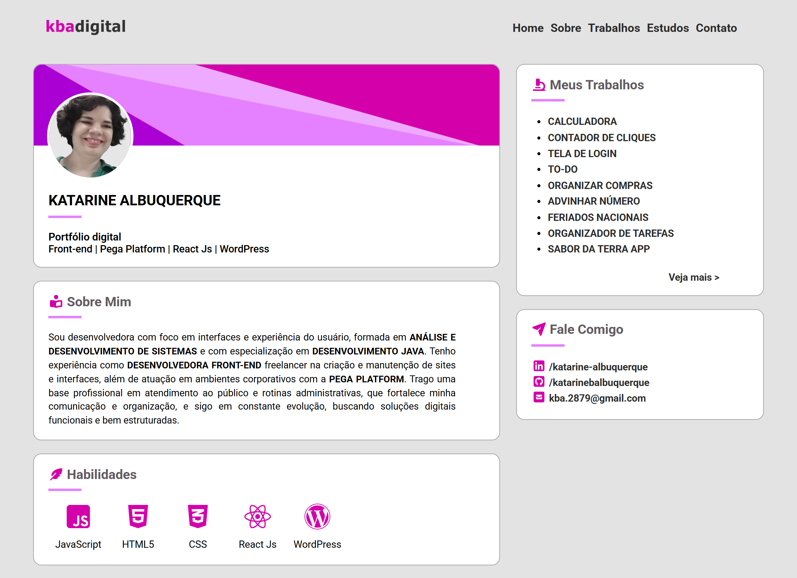

# Portfólio Digital
## HTML5, CSS e JavaScript

 

Acesse o projeto: [Portfólio Digital](https://albuquerque-katarine.github.io/portfolio/) 

### Sobre o projeto

- Portfólio digital desenvolvido utilizando HTML5, CSS e JavaScript.
- Estrutura focada em boas práticas de front-end e organização do código.
- Integração com API em JSON para consumo e exibição dinâmica de dados.
- Layout responsivo, adaptável a diferentes tamanhos de tela e dispositivos.
- Navegação clara, funcional e orientada à experiência do usuário (UI/UX).

### Finalidade do projeto

- Apresentar projetos e habilidades técnicas de forma clara e organizada.
- Demonstrar domínio em desenvolvimento front-end e consumo de APIs em JSON.
- Evidenciar a aplicação de layout responsivo e boas práticas de UI/UX.
- Servir como portfólio profissional digital, facilitando a visualização por recrutadores e clientes.
- Centralizar informações profissionais em um único ambiente acessível e funcional.

### Contatos

E-mail: [kba.2879@gmail.com](mailto:kba.2879@gmail.com) 
Linkedin: [/katarine-albuquerque](https://www.linkedin.com/in/katarine-albuquerque/)  
GitHub: [/katarinebalbuquerque](https://github.com/katarinebalbuquerque)  

